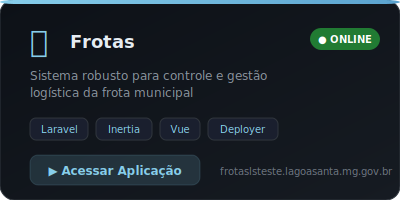
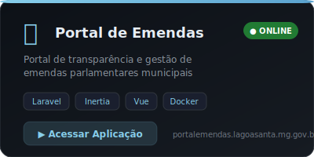
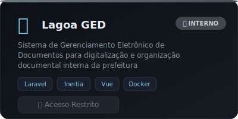
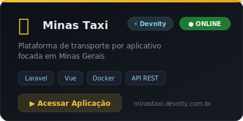
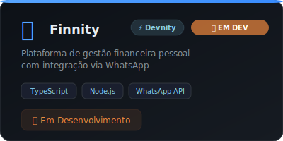
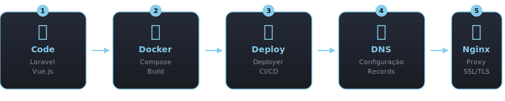

<div align="center">

<!-- HEADER -->


<a href="https://git.io/typing-svg">
  
</a>

</div>

<!-- ══════════════════════════════════════════════════════════════════ -->

<div align="center">
  
</div>

```bash
╭─ leandro@lagoa-santa ~ ─────────────────────────────────────────────────╮
│                                                                          │
│  $ whoami                                                                │
│  > Leandro Lucas Domingos                                                │
│                                                                          │
│  $ cat /etc/cargo                                                        │
│  > Coordenador Municipal - Coordenacao de Sistemas e Aplicacoes          │
│  > Prefeitura de Lagoa Santa, MG                                         │
│                                                                          │
│  $ cat /etc/empresa                                                      │
│  > Fundador & CEO - Devnity (devnity.com.br)                             │
│                                                                          │
│  $ cat /etc/role                                                         │
│  > Full Stack Developer | DevOps Engineer                                │
│  > Servidor do zero > Deploy > DNS > Monitoramento                       │
│                                                                          │
│  $ cat /etc/hobbies                                                      │
│  > Gamer (mass kill, lag, repeat)                                        │
│                                                                          │
╰──────────────────────────────────────────────────────────────────────────╯
```

---

<!-- ══════════════════════════════════════════════════════════════════ -->

<div align="center">
  

<br/>

<h3><code>// backend</code></h3>

<a href="https://laravel.com"></a>
<a href="https://php.net"></a>
<a href="https://inertiajs.com"></a>
<a href="https://nodejs.org"></a>
<a href="https://python.org"></a>

<h3><code>// frontend</code></h3>

<a href="https://vuejs.org"></a>
<a href="https://react.dev"></a>
<a href="https://typescriptlang.org"></a>
<a href="https://developer.mozilla.org/docs/Web/JavaScript"></a>
<a href="https://tailwindcss.com"></a>

<h3><code>// devops & infra</code></h3>

<a href="https://docker.com"></a>
<a href="https://kernel.org"></a>
<a href="https://nginx.org"></a>
<a href="https://deployer.org"></a>
<a href="https://postgresql.org"></a>
<a href="https://mysql.com"></a>
<a href="https://git-scm.com"></a>

</div>

---

<!-- ══════════════════════════════════════════════════════════════════ -->

<div align="center">
  
</div>

<br/>

```
  ┌─────────────────────────────────────────────────────────────────┐
  │  > Finnity :: Plataforma financeira pessoal                     │
  │                                                                 │
  │    Modulo Core          [################--]  85%               │
  │    Integracao WhatsApp  [############------]  65%               │
  │    Dashboard Charts     [########----------]  45%               │
  │    Deploy Producao      [###---------------]  15%               │
  └─────────────────────────────────────────────────────────────────┘
```

---

<!-- ══════════════════════════════════════════════════════════════════ -->

<div align="center">
  
</div>

<p align="center">
  <sub><code>Laravel</code> + <code>Inertia.js</code> + <code>Vue.js</code> | <code>SQL</code> | <code>Deployer</code> | <code>Docker</code></sub>
</p>

<div align="center">
  <a href="https://lagoasport.lagoasanta.mg.gov.br/">
    
  </a>
  &nbsp;&nbsp;
  <a href="https://frotaslsteste.lagoasanta.mg.gov.br/">
    
  </a>
</div>
<br/>
<div align="center">
  <a href="https://portalemendas.lagoasanta.mg.gov.br/">
    
  </a>
  &nbsp;&nbsp;
  
</div>

---

<!-- ══════════════════════════════════════════════════════════════════ -->

<div align="center">
  
</div>

<br/>

<div align="center">
  <a href="https://minastaxi.devnity.com.br/">
    
  </a>
  &nbsp;&nbsp;
  
</div>

---

<!-- ══════════════════════════════════════════════════════════════════ -->

<div align="center">
  
</div>

<br/>

<div align="center">
  
</div>

---

<!-- ══════════════════════════════════════════════════════════════════ -->

<div align="center">
  
</div>

<br/>

<div align="center">
  
</div>

---

<div align="center">
  
</div>

---

<!-- ══════════════════════════════════════════════════════════════════ -->

<div align="center">


<br/><br/>

<a href="https://www.leandrolucas.com.br">
  
</a>
&nbsp;
<a href="https://github.com/LeandroLDomingos">
  
</a>

<br/><br/>

<a href="https://git.io/typing-svg">
  
</a>

<br/>


</div>


